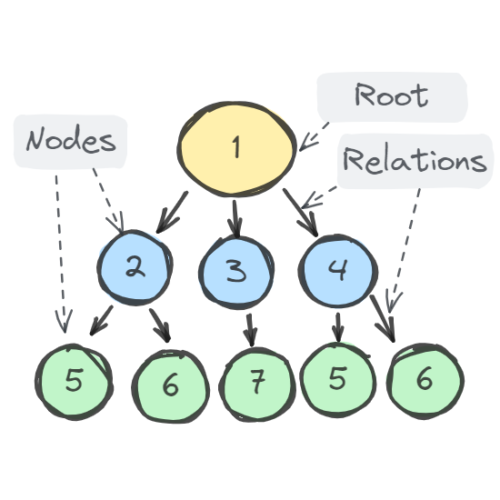

## Contingut
Projecte d'exemple de **koltin multiplatform** (amb **build Gradle** creat amb IntelliJ IDEA Ultimate Edition) com a demostració d'**ús de recursivitat** en aquest cas, **recorrent un arbre N-ari**.

## Versió JDK
Amazon Corretto 17.0.13

